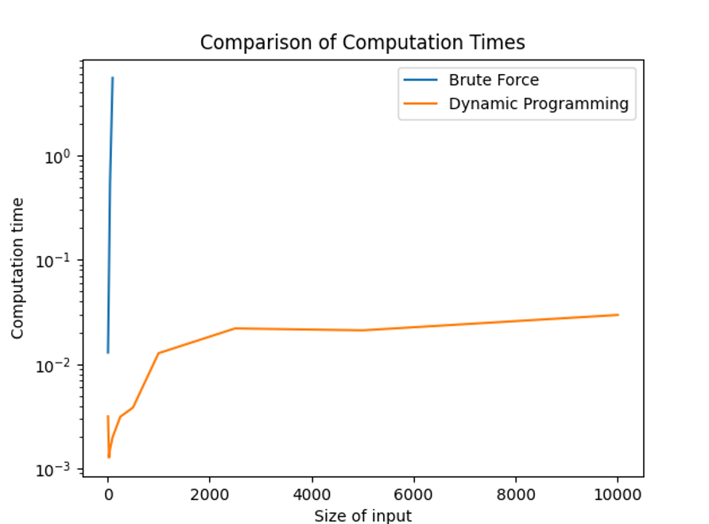

# Fruit Algorithm

This project implements and compares two different approaches (brute force and dynamic programming) to solve an optimization problem involving fruit sequences. The problem involves manipulating a sequence of apples and pears to minimize the number of apples that can be picked at regular intervals.

## Problem Description

Given a sequence of fruits (apples and pears), where:
- `n` is the initial length of the sequence
- `k` is the maximum number of apples that can be inserted
- `m` is the picking interval

The goal is to strategically insert apples into the sequence to minimize the number of apples that would be picked when selecting every m-th fruit from the sequence.

## Implementation

The project contains two main implementations:

1. **Brute Force Solution** (`bruteforce.cpp`)
   - Tries all possible combinations of apple insertions
   - Guarantees optimal solution but becomes impractical for large inputs
   - Time complexity: O(2^(n+k))

2. **Dynamic Programming Solution** (`main.cpp`)
   - Uses dynamic programming to efficiently find the optimal solution
   - Maintains good performance even with larger inputs
   - Time complexity: O(n*k)

## Building and Running

To compile the programs:
```bash
g++ -o bruteforce bruteforce.cpp
g++ -o main main.cpp
```

To run either solution:
```bash
./bruteforce <input_file>
# or
./main <input_file>
```

### Input File Format
```
n k m
sequence
```
Where sequence is a string of 0s (pears) and 1s (apples).

## Output Format
The programs output:
1. The minimum number of apples that will be picked
2. The number of insertions made followed by their positions (1-based indexing)
3. The execution time in seconds

## Performance Comparison

The dynamic programming solution significantly outperforms the brute force approach for:
- Sequences longer than 1000 elements
- Cases where k > 20
- Complex combinations of n, k, and m

For small inputs (n < 100), both solutions perform reasonably well.

## Graph of Time Complexity


